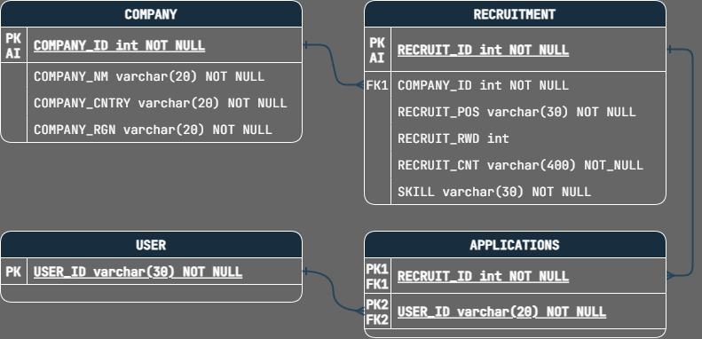

# 원티드 프리온보딩 백엔드 인턴십

## 💼 프로그램 소개

`원티드`에 진행하는 프로그램으로, `사전 과제`와 `4주` 동안 `기업 과제`를 수행하면서 작업한 협업 또는 개인 `프로젝트`와 `기록`한 것들을 정리해보았습니다.

- [[ Organization ] 원티드 프리온보딩 백엔드 인턴십 - TEAM E](https://github.com/Wanted-Pre-Onboarding-Team-E)

### :file_folder: 수행한 기업 과제 목록

- [[ 피드모아 ] 소셜 미디어 통합 Feed 서비스 RESTful API 서버, laetipark, github](https://github.com/laetipark/feed-moa)
- [[ 여기가자 ] 지리기반 맛집 추천 서비스 RESTful API 서버, laetipark, github](https://github.com/laetipark/lets-go-here)
- [[ 돈이머니 ] 예산 관리 서비스 RESTful API 서버, laetipark, github](https://github.com/laetipark/money-is-money)

## 🛠️ 활용 기술 스택

&nbsp;
&nbsp;
&nbsp;
  
&nbsp;
&nbsp;
&nbsp;


### :notebook: TIL(Today I Learned) 목록

- [231027 TIL, laetipark, blex](https://blex.me/@laetipark/%EC%9B%90%ED%8B%B0%EB%93%9C-%ED%94%84%EB%A6%AC%EC%98%A8%EB%B3%B4%EB%94%A9-%EB%B0%B1%EC%97%94%EB%93%9C-%EC%9D%B8%ED%84%B4%EC%8B%AD-7th-231027-til)
- [231030 TIL, laetipark, blex](https://blex.me/@laetipark/%EC%9B%90%ED%8B%B0%EB%93%9C-%ED%94%84%EB%A6%AC%EC%98%A8%EB%B3%B4%EB%94%A9-%EB%B0%B1%EC%97%94%EB%93%9C-%EC%9D%B8%ED%84%B4%EC%8B%AD-7th-231030-til)
- [231103 TIL, laetipark, blex](https://blex.me/@laetipark/%EC%9B%90%ED%8B%B0%EB%93%9C-%ED%94%84%EB%A6%AC%EC%98%A8%EB%B3%B4%EB%94%A9-%EB%B0%B1%EC%97%94%EB%93%9C-%EC%9D%B8%ED%84%B4%EC%8B%AD-7th-231103-til)
- [231106 TIL, laetipark, blex](https://blex.me/@laetipark/%EC%9B%90%ED%8B%B0%EB%93%9C-%ED%94%84%EB%A6%AC%EC%98%A8%EB%B3%B4%EB%94%A9-%EB%B0%B1%EC%97%94%EB%93%9C-%EC%9D%B8%ED%84%B4%EC%8B%AD-7th-231106-til)
- [231108 TIL, laetipark, blex](https://blex.me/@laetipark/%EC%9B%90%ED%8B%B0%EB%93%9C-%ED%94%84%EB%A6%AC%EC%98%A8%EB%B3%B4%EB%94%A9-%EB%B0%B1%EC%97%94%EB%93%9C-%EC%9D%B8%ED%84%B4%EC%8B%AD-7th-231108-til)
- [231113 TIL, laetipark, blex](https://blex.me/@laetipark/%EC%9B%90%ED%8B%B0%EB%93%9C-%ED%94%84%EB%A6%AC%EC%98%A8%EB%B3%B4%EB%94%A9-%EB%B0%B1%EC%97%94%EB%93%9C-%EC%9D%B8%ED%84%B4%EC%8B%AD-7th-231113-til)
- [231117 TIL, laetipark, blex](https://blex.me/@laetipark/%EC%9B%90%ED%8B%B0%EB%93%9C-%ED%94%84%EB%A6%AC%EC%98%A8%EB%B3%B4%EB%94%A9-%EB%B0%B1%EC%97%94%EB%93%9C-%EC%9D%B8%ED%84%B4%EC%8B%AD-7th-231117-til)

## #️⃣ 사전 과제 소개

기업의 채용을 위한 것으로 `회사`는 `채용공고`를 `생성`하고, 이에 `사용자`는 `지원`하는 서비스를 개발하는 `서비스`입니다.

## :gear: 환경 설정 및 실행

- 데이터베이스 스키마는 `wanted`라는 이름으로 생성하였습니다.
  ```sql
  CREATE DATABASE `wanted`
  DEFAULT CHARACTER SET utf8mb4 COLLATE utf8mb4_unicode_ci
  DEFAULT ENCRYPTION='N';
  ```
- 데이터베이스 환경은 /config/env/폴더에서 설정할 수 있습니다.
    ```dotenv
    HOST_PORT='서버 포트'
    DATABASE_HOST='데이터베이스 주소'
    DATABASE_PORT='데이터베이스 포트'
    DATABASE_USERNAME='계정 이름'
    DATABASE_PASSWORD='계정 비밀번호'
    DATABASE_NAME='데이터베이스 이름'
    ```
- `start.sh` 또는 `start.bat`를 통해 **데이터베이스 테이블을 구성**하고 회사(Company), 사용자(User) **임의 데이터를 생성**한 뒤 **어플리케이션을 실행**합니다.
  ```shell
  # 리눅스 사용자일 경우
  sh start.sh
  ```
    ```shell
  # 윈도우 사용자일 경우
  ./start.bat
  ```

## :cd: 데이터베이스 모델링



- **COMPANY** : 회사
- **USER** : 사용자
- **RECRUITMENT** : 채용공고
- **APPLICATIONS** : 지원내역

## :memo: API 명세

> [`GitHub Wiki`로 이동! 🏃🏻‍💨](https://github.com/laetipark/wanted-pre-onboarding-backend/wiki/REST-API)