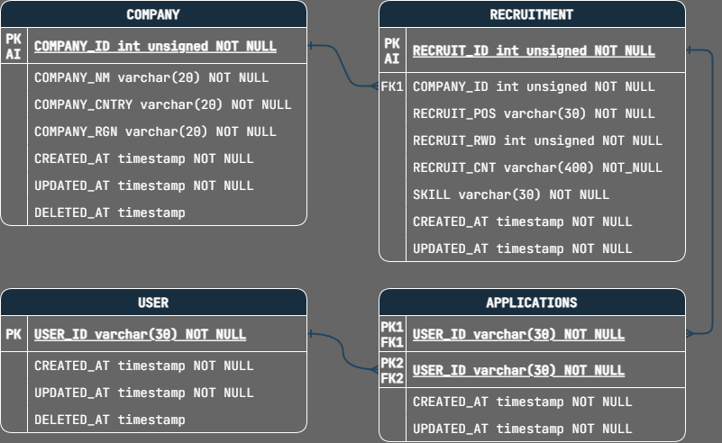

# 원티드 프리온보딩 백엔드 인턴십 사전 과제

## 개발 환경

- 언어 및 런타임 환경 : Typescript, Node.js
- 프레임워크 : NestJS
- 데이터베이스 : MySQL

## 데이터베이스 모델링



- COMPANY : 회사
- USER : 사용자
- RECRUITMENT : 채용공고
- APPLICATIONS : 지원내역

## 환경 설정

- 데이터베이스 환경은 /config/env/폴더에서 설정할 수 있습니다.
    ```dotenv
    HOST_PORT='서버 포트'
    DATABASE_HOST='데이터베이스 주소'
    DATABASE_PORT='데이터베이스 포트'
    DATABASE_USERNAME='계정 이름'
    DATABASE_PASSWORD='계정 비밀번호'
    DATABASE_NAME='데이터베이스 이름'
    ```

## API

### 1. 채용공고를 등록합니다.

`POST /recruitment/`

#### Request(Body)

```json
{
  "companyID": 1,
  "position": "백엔드 주니어 개발자",
  "reward": 1000000,
  "content": "원티드랩에서 백엔드 주니어 개발자를 채용합니다. 자격요건은..",
  "skill": "Python"
}
```

#### Response(201)

```json
{
  "message": "정상적으로 채용 공고를 등록하였습니다.",
  "data": {
    "companyID": 1,
    "position": "백엔드 주니어 개발자",
    "reward": 1000000,
    "content": "원티드랩에서 백엔드 주니어 개발자를 채용합니다. 자격요건은..",
    "skill": "Python",
    "recruitID": "11"
  }
}
```

#### ERROR(404)

```json
{
  "message": "Company with ID 99 not found.",
  "error": "Not Found",
  "statusCode": 404
}
```

### 2. 채용공고를 수정합니다.

`PATCH /recruitment/:id`

#### Request(Body)

```json
{
  "position": "백엔드 주니어 개발자",
  "reward": 1500000,
  "content": "원티드랩에서 백엔드 주니어 개발자를 '적극' 채용합니다. 자격요건은..",
  "skill": "NodeJS"
}
```

#### Response(200)

```json
{
  "message": "채용공고 11번을 수정하였습니다.",
  "data": {
    "position": "백엔드 주니어 개발자",
    "reward": 1500000,
    "content": "원티드랩에서 백엔드 주니어 개발자를 '적극' 채용합니다. 자격요건은..",
    "skill": "NodeJS"
  }
}
```

#### ERROR(400)

```json
{
  "message": "채용공고의 position/reward/content/skill 내용이 비어있습니다.",
  "error": "Bad Request",
  "statusCode": 400
}
```

### 2. 채용공고를 삭제합니다.

`DELETE /recruitment/:id`

#### Response(200)

```json
{
  "message": "채용공고 14번을 삭제하였습니다."
}
```

#### ERROR(404)

```json
{
  "message": "채용공고 14번이 존재하지 않습니다.",
  "error": "Not Found",
  "statusCode": 404
}
```